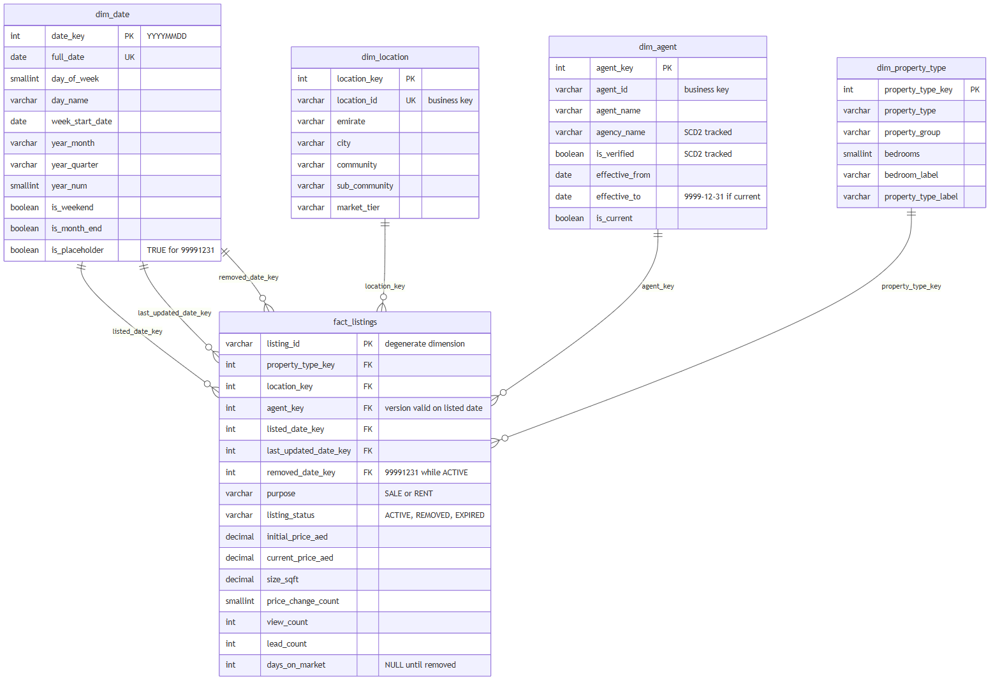

# Property Data Warehouse (Star Schema)

A dimensional model for UAE real-estate listings: a star schema (`fact_listings` plus `dim_location`, `dim_agent`, `dim_property_type`, `dim_date`), the SQL that loads it from raw extracts, automated data-quality checks, and eight analytical queries that exercise the model.

Everything runs locally on [DuckDB](https://duckdb.org/) with one `pip install` and no server. The dataset is **synthetic** (seeded generator, invented agents and agencies, made-up prices), so the figures illustrate the model and are not market data.

## The model



| Table | Grain | Notes |
|---|---|---|
| `fact_listings` | one row per listing | Accumulating snapshot; three role-playing date keys; 7 measures |
| `dim_date` | one row per calendar day | Includes a `99991231` "not yet occurred" member |
| `dim_location` | one row per sub-community | Emirate > city > community > sub-community, flattened. SCD Type 1 |
| `dim_property_type` | property type x bedroom count | e.g. "2 BR Apartment". SCD Type 1 |
| `dim_agent` | one row per agent **version** | SCD Type 2 on `agency_name` and `is_verified` |

The diagram source is [docs/er_diagram.mmd](docs/er_diagram.mmd) (Mermaid).

## Design decisions

**Accumulating snapshot, one row per listing.** A listing has a lifecycle (posted, price changes, removed or expired), so the row is updated as it progresses. That is why there are three date roles (`listed`, `last_updated`, `removed`), all pointing at the same `dim_date`.

**No NULL foreign keys.** A listing that is still active has no removal date, so `removed_date_key` points at the `99991231` member of `dim_date` rather than being NULL. The payoff is in [Q08](sql/analytics/q08_month_end_inventory.sql): "live on date D" is just `listed_date_key <= D AND removed_date_key > D`, with no special case for active listings. Unmatched business keys work the same way, landing on a `-1` "Unknown" member in the other dimensions instead of being dropped.

**SCD Type 2 with a point-in-time join.** When an agent changes agency or gets verified, `dim_agent` gets a new row. The fact load ([06](sql/06_load_fact_listings.sql)) picks the version whose validity interval contains the listing's listed date, so a listing stays credited to the agency the agent worked for *at that time*. In this dataset 1,015 of 5,997 listings point at a non-current agent version. [Q06](sql/analytics/q06_agency_attribution_scd2.sql) shows what a Type 1 dimension would have gotten wrong:

| agency | listings (correct, SCD2) | listings (Type 1) | error |
|---|---:|---:|---:|
| Summit Gate Properties | 368 | 495 | +127 |
| Blue Harbour Estates | 155 | 87 | -68 |
| Cedar Lane Homes | 543 | 481 | -62 |
| Skybridge Properties | 150 | 103 | -47 |
| Ironwood Property Partners | 386 | 341 | -45 |

**Ratios are not additive.** Price per sqft is computed as `SUM(price) / SUM(size)`, never `AVG(price / size)`, which over-weights small units ([Q01](sql/analytics/q01_price_per_sqft_by_community.sql) shows both side by side). Sale prices and annual rents are different quantities, so every price query filters or groups by `purpose`.

**Trade-off: `purpose` and `listing_status` live on the fact.** They are low-cardinality descriptors that Kimball would normally place in a junk dimension. I kept the model to the five requested tables; at production scale they would move to a `dim_listing_profile`, and the fact would carry one key instead of two text columns.

**A build that can fail.** `python build.py` finishes with 11 data-quality assertions ([07_quality_checks.sql](sql/07_quality_checks.sql)): reconciliation of row counts and total price against staging, SCD2 interval integrity (one current row per agent, no gaps or overlaps), point-in-time correctness of every agent key, lifecycle date ordering, and a cap on the share of rows landing on Unknown members. A non-zero exit means a check failed. The source data deliberately includes 5 listings with an unknown location id and 3 with a zero size; the load routes the first to the Unknown member and the second to `stg.listings_rejected`.

## Run it

```bash
pip install -r requirements.txt      # just DuckDB
python build.py                      # builds warehouse.duckdb, runs the quality checks
python run_queries.py                # runs all eight analytical queries
python run_queries.py q06            # or just one
python run_queries.py --markdown     # regenerate docs/sample_query_results.md
```

`build.py` sets its own working directory. If you run the SQL files by hand (for example in the DuckDB CLI), do so from the project root, because they read `data/raw/*.csv` by relative path. To regenerate the source CSVs (deterministic, fixed seed): `python data/generate_sample_data.py`.

To explore interactively: `python -c "import duckdb; duckdb.connect('warehouse.duckdb').sql('SELECT * FROM dim_agent LIMIT 5').show()"`, or open `warehouse.duckdb` in the DuckDB CLI.

## Pipeline

```
data/raw/*.csv --> stg.* (typed staging) --> stg.listings_clean / listings_rejected
                                          --> dim_date, dim_location, dim_property_type, dim_agent (SCD2)
                                          --> fact_listings (surrogate-key lookups, point-in-time agent join)
                                          --> quality checks
```

| Script | Does |
|---|---|
| [01_schema.sql](sql/01_schema.sql) | DDL for all tables, sequences, constraints, comments. Re-runnable |
| [02_stage_sources.sql](sql/02_stage_sources.sql) | Loads CSVs with explicit types; splits valid vs rejected listings |
| [03_load_dim_date.sql](sql/03_load_dim_date.sql) | Generates the calendar and the placeholder member |
| [04_load_dim_location_property_type.sql](sql/04_load_dim_location_property_type.sql) | Type 1 dimensions plus Unknown members |
| [05_load_dim_agent_scd2.sql](sql/05_load_dim_agent_scd2.sql) | Turns a change log into validity intervals with `LEAD()` |
| [06_load_fact_listings.sql](sql/06_load_fact_listings.sql) | Key lookups, point-in-time join, derived `days_on_market` |
| [07_quality_checks.sql](sql/07_quality_checks.sql) | Post-load assertions |

## Sample analytical queries

Full output for each is in [docs/sample_query_results.md](docs/sample_query_results.md).

| Query | Business question | Modelling idea |
|---|---|---|
| [Q01](sql/analytics/q01_price_per_sqft_by_community.sql) | Most expensive communities per sqft | Non-additive ratio, weighted correctly |
| [Q02](sql/analytics/q02_gross_rental_yield.sql) | Best gross rental yield by community and bedrooms | `FILTER` pivots sale vs rent onto one row |
| [Q03](sql/analytics/q03_monthly_supply_trend.sql) | Monthly new supply and MoM change | `dim_date` grouping, `LAG()` |
| [Q04](sql/analytics/q04_days_on_market.sql) | Time to removal by property type | Median/p90; cohort chosen to limit censoring bias |
| [Q05](sql/analytics/q05_price_cut_behaviour.sql) | How often and how deeply prices are cut | Conditional weighted aggregates |
| [Q06](sql/analytics/q06_agency_attribution_scd2.sql) | Agency league table, SCD2 vs Type 1 | Historical attribution |
| [Q07](sql/analytics/q07_top_agent_per_agency.sql) | Best lead-converting agent per agency | Group by business key; `RANK() OVER (PARTITION BY ...)` |
| [Q08](sql/analytics/q08_month_end_inventory.sql) | Active inventory at every month-end | Point-in-time reconstruction via the placeholder date |

## Layout

```
property-data-warehouse/
├── build.py                 build + quality gate
├── run_queries.py           run / document the analytical queries
├── requirements.txt
├── data/
│   ├── generate_sample_data.py
│   └── raw/                 locations.csv, agent_history.csv, listings.csv
├── sql/
│   ├── 01 ... 07_*.sql      schema, staging, loads, quality checks
│   └── analytics/           q01 ... q08
└── docs/                    er_diagram.png / .mmd, sample_query_results.md
```

## Limitations

- **Full refresh only.** Each build recreates the warehouse. The SCD2 logic (change log to intervals, point-in-time join) is what an incremental load would reuse, but incremental merge and late-arriving-fact handling are not implemented.
- **No public holidays** in `dim_date`; several UAE holidays depend on moon sighting and would need a maintained source.
- **DuckDB dialect.** Most SQL is portable. For PostgreSQL, swap `MEDIAN(x)` for `percentile_cont(0.5) WITHIN GROUP (ORDER BY x)`, `read_csv(...)` for `COPY`, and DuckDB's `isodow`/`dayname` helpers for `EXTRACT`/`to_char`.
